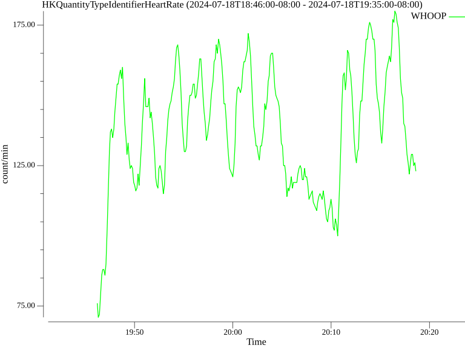

# health-data-parser

## Usage

### Prerequisite: Health Export

1. Open the Apple Health app
2. Click the profile icon in the top right-hand corner
3. Scroll to the bottom and click "Export All Health Data"
4. On the pop-up, select "Export"
5. When the export is finished, click "Save to Files" and save it to a recognizable folder

### View Options
```
go run cmd/health_data_parser/main.go -h
```

### Example Parsing

```
# Set the export path
EXPORT_PATH=/path/to/export.xml

go run cmd/health_data_parser/main.go \
    -input=$EXPORT_PATH \
    -start="2024-07-18T18:46:00-08:00" \
    -end="2024-07-18T19:35:00-08:00" \
    -type="HKQuantityTypeIdentifierHeartRate" \
    -sources="WHOOP"
```

### Example plot


